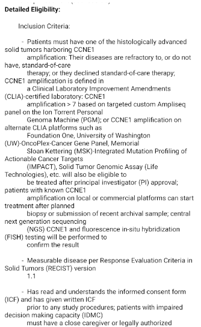

# CTGOV Data Formatter

Ever had issues with displaying the parsed data from CTGOV on web/mobile pages? And wanted to display the data in a user friendly format? Then ctgov-ocr-formatter is what you are looking for!

## Description

Simple string converter that removes unnecessary carriage returns and line breaks from the clinical trials parsed data. It returns a clean displayable string for your web and mobile pages. Uses regular expression and string functions to format the data.

Before formatting




After formatting


## Installation

Formatter is available in npm. Just `npm i ctgov-ocr-formatter` will download the packages and its dependencies.

## Usage

After installing the library, you can now easily clean up the data formatting

Typescript:
```
import { Formatter } from "ctgov-ocr-formatter";
let iFormatter = new Formatter();
let detailedEligibility = result['clinical_study']['eligibility'][0].criteria[0].textblock[0];
```

Javascript:

```
var formatter = require('ctgov-ocr-formatter');
var iformat = new formatter();
var detailedEligibility = result['clinical_study']['eligibility'][0].criteria[0].textblock[0].toLocaleString();
var formattedDetailedEligibility = iFormatter.formatData(detailedEligibility);
```
Note :  result['clinical_study']['eligibility'][0].criteria[0].textblock[0] is the xml parsed object from clinical trials. For, more detailed coding please check the test scripts available under `__test__` folder

## Development
You need latest version of Node and npm.

### npm scripts

- `npm run lint`: Run [ESLint] \(including [Prettier]).
- `npm run format`: Run [ESLint] \(including [Prettier]).
- `npm run jest`: Run unit tests. During development, `npm run jest -- --watch`
  is nice.
- `npm test`: Check that everything works.


